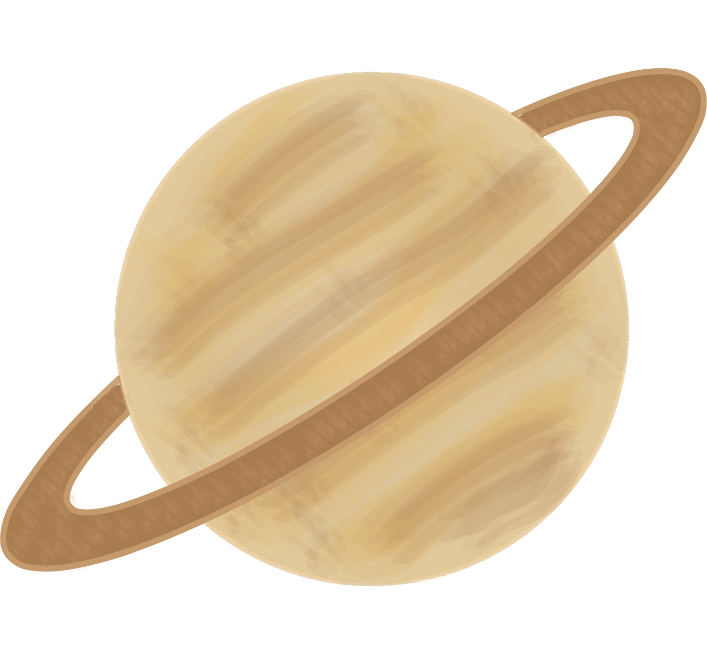

# Viagem pelo Espaço 
### Trabalho Realizado por: António Cruz - 220000502 e Camila Lourenço - 220000606

## Tema: Viagem pelo Espaço

### Descrição 	
O jogador controla uma nave espacial que tem que se desviar dos vários planetas e asteróides. Se o jogador colidir com algum planeta ou asteróide perderá o jogo terá uma breve explicação do sistema solar. Este jogo é direcionado para o 2º ciclo.

### Recursos do jogo 	

- Personagem principal: Nave Espacial
- Modo do jogo: O jogo ocorre na horizontal com a gravidade influenciando o movimento da nave (cima, baixo). Essa nave terá que se desviar dos vários planetas e asteróides que vão aparecendo no plano do jogo.
- Obstáculos: O jogador enfrentará obstáculos como planetas, asteróides que devem ser superados. Os planetas aparecerão pela ordem do sistema solar (Mercúrio, Vénus, Terra, Marte, Júpiter, Saturno, Urano e Neptuno e Plutão).
- Colisão: Duranto o jogo o jogador poderá vir a colidir com um planeta ou meteorito. Se isso acontecer, poderá perder o jogo e irá a aprecer uma breve explicação do que é o sitema solar. 
  
### Elementos Do Jogo

## Personagem principal - Nave Espacial

## Planetas e Asteróides

# Mercúrio

# Vénus

# Terra

# Marte

# Júpiter

# Saturno

# Urano

# Neptuno

# Plutão

# Meteorito

# Meteorito Fogo

## Logo 	

## Ercãs - Situações do Jogo	

## Mockups

# T-shirt

# Caneca

## Link Video de Apresentação do Jogo	
[Video de Apresentação](https://youtu.be/FeuOZX3zYRA)

